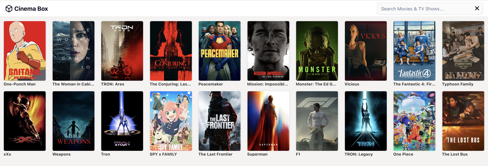

> [!NOTE]
> If movies aren't loading, please try changing your browser's DNS server.

# Cinema Box
Web app for searching movie

## 🌐 Live Demo
[Click here](https://cinema-box-mocha.vercel.app/)

---

## Screenshots


---

## 🛠 Tech Stack
- **Library:** React, Shadcn UI
- **Language:** Javascript, TypeScript
- **Styling:** Tailwind CSS
- **Deployment:** Vercel

---

## ⚙️ Installation & Setup

To run the project locally, follow these steps:

```bash

# Clone the repository
git clone https://github.com/shubhamtak007/cinema-box.git

# Navigate to the project directory
cd cinema-box

# Install dependencies
npm install

# Start the development server
npm run dev
```

## License
Cinema Box is [MIT licensed](./LICENSE).